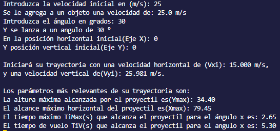
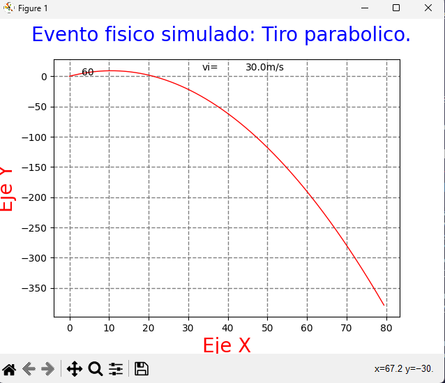
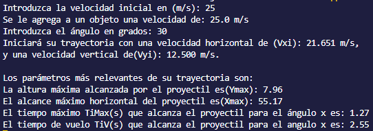

# Fisica-trabajo

Trabajo tiro parabolico

Breve historia asociada (origen):

El concepto del tiro parabólico tiene sus raíces en la antigua Grecia. Fue estudiado por primera vez por el matemático y filósofo griego Aristóteles en el siglo IV a.C. Aristóteles observó que los objetos lanzados en el aire describen una trayectoria curva y desarrolló una teoría básica para describir este tipo de movimiento. A lo largo de los siglos, varios científicos y matemáticos, como Galileo Galilei y Sir Isaac Newton, han contribuido a nuestro entendimiento y desarrollo de las ecuaciones del tiro parabólico.

Matemática empleada:

El tiro parabólico utiliza conceptos y fórmulas de la física y la matemática. Algunas de las principales herramientas matemáticas utilizadas son:

1. Trigonometría: Se utilizan las funciones trigonométricas seno, coseno y tangente para calcular las componentes horizontal y vertical de la velocidad, así como para determinar ángulos y relaciones trigonométricas en la trayectoria.
2. Geometría analítica: Se utilizan conceptos de la geometría analítica, como las ecuaciones de una recta y la resolución de sistemas de ecuaciones, para describir y analizar la trayectoria del proyectil.
3. Cálculo diferencial: A través del cálculo diferencial, se derivan ecuaciones que describen la posición, velocidad y aceleración del proyectil en función del tiempo. Esto permite calcular y analizar diferentes parámetros de la trayectoria.

Cómo se resuelve:

El tiro parabólico se resuelve utilizando una serie de fórmulas y ecuaciones derivadas de los principios de la mecánica clásica. Algunas de las principales etapas para resolver el tiro parabólico son:

1. Recopilación de datos: Se recopilan los valores de la velocidad inicial (vi), el ángulo de lanzamiento (θ) y la gravedad (g) para el proyectil.
2. Conversión de unidades: Si es necesario, se convierten los valores ingresados a las unidades adecuadas (por ejemplo, convertir grados a radianes).
3. Cálculos iniciales: Se realizan cálculos iniciales, como el cálculo de las componentes horizontal y vertical de la velocidad inicial (vho y vver) y la conversión del ángulo a radianes.
4. Cálculos de la trayectoria: Se utilizan fórmulas derivadas de la física del movimiento para calcular diferentes parámetros de la trayectoria, como la altura máxima alcanzada (ymax), el alcance horizontal (xmax) y los tiempos de vuelo (tmax y tv).
5. Representación gráfica: Se utiliza una biblioteca gráfica, como Matplotlib, para representar visualmente la trayectoria del proyectil en un gráfico.

Aplicaciones:

El tiro parabólico tiene numerosas aplicaciones en la vida cotidiana y en diferentes campos científicos y tecnológicos. Algunas de las aplicaciones más comunes incluyen:

1. Deportes: El análisis del tiro parabólico se utiliza en deportes como el baloncesto, el fútbol y el golf para predecir la trayectoria de la pelota y calcular las fuerzas y ángulos necesarios para lograr determinados objetivos.
2. Proyectiles y balística: El tiro parabólico se utiliza en la balística para predecir la trayectoria de proyectiles, como balas y cohetes. Esto es importante para la seguridad, el diseño de armas y la precisión en la puntería.
3. Ingeniería de proyectiles: El diseño de proyectiles, como misiles y cohetes, requiere el análisis y la simulación del tiro parabólico para lograr un vuelo controlado y alcanzar objetivos específicos.
4. Juegos y simulaciones: El tiro parabólico se utiliza en juegos y simulaciones virtuales para crear experiencias realistas y calcular el movimiento de objetos en entornos virtuales.
5. Estudios científicos: El análisis del tiro parabólico se utiliza en diferentes estudios científicos, como la investigación de la trayectoria de partículas en física de partículas, el estudio del movimiento de objetos en la atmósfera terrestre y el análisis de fenómenos naturales, como la caída de meteoritos.

   

Ejercicio 1:

Un proyectil se lanza con una velocidad inicial de 30 m/s a un ángulo de inclinación de 60 grados respecto a la horizontal. Queremos determinar el tiempo que tarda en alcanzar su altura máxima y el alcance máximo horizontal.

Datos:

* Velocidad inicial (v0) = 30 m/s
* Ángulo de inclinación (θ) = 60 grados
* Aceleración debido a la gravedad (g) = 9.8 m/s^2

Ejercicio 2:

Un objeto se lanza con una velocidad inicial de 25 m/s a un ángulo de inclinación de 30 grados respecto a la horizontal. Queremos determinar la altura máxima alcanzada y el tiempo de vuelo.

Datos:

* Velocidad inicial (v0) = 25 m/s
* Ángulo de inclinación (θ) = 30 grados
* Aceleración debido a la gravedad (g) = 9.8 m/s^2

Desarrolo ejercicio 1:

Un proyectil se lanza con una velocidad inicial de 30 m/s a un ángulo de inclinación de 60 grados respecto a la horizontal. Queremos determinar el tiempo que tarda en alcanzar su altura máxima y el alcance máximo horizontal.

Datos:

* Velocidad inicial (v0) = 30 m/s
* Ángulo de inclinación (θ) = 60 grados
* Aceleración debido a la gravedad (g) = 9.8 m/s^2

Para resolver este ejercicio, utilizaremos las siguientes fórmulas del tiro parabólico:

1. Componente horizontal de la velocidad inicial:

   v0x = v0 * cos(θ)
2. Componente vertical de la velocidad inicial:

   v0y = v0 * sin(θ)
3. Tiempo para alcanzar la altura máxima:

   t_max = v0y / g
4. Alcance máximo horizontal:

   x_max = v0x * (2 * t_max)

Resolución:

Primero, calcularemos las componentes horizontal y vertical de la velocidad inicial:

v0x = v0 * cos(θ)

v0y = v0 * sin(θ)

v0x = 30 m/s * cos(60°) = 30 m/s * 0.5 = 15 m/s

v0y = 30 m/s * sin(60°) = 30 m/s * √3/2 ≈ 25.98 m/s

A continuación, determinaremos el tiempo que tarda en alcanzar la altura máxima:

t_max = v0y / g

t_max = 25.98 m/s / 9.8 m/s^2 ≈ 2.65 s

Por último, calcularemos el alcance máximo horizontal:

x_max = v0x * (2 * t_max)

x_max = 15 m/s * (2 * 2.65 s) ≈ 79.5 m

Por lo tanto, el proyectil tarda aproximadamente 2.65 segundos en alcanzar su altura máxima y su alcance máximo horizontal es de aproximadamente 79.5 metros.

Al ejecutar el algoritmo realizado y poner los datos del problema o ejercicio 1 osea la velocidad inicial y los grados, el codigo genera los mismos datos o bastante similares a los resultados realizados con desarrollo, debido a que el algoritmo hace lo mismo, osea saca la altira maxima, el alcance maximo horizontal y algunos datos más debido a que con las librerias facilita el sacar los resultados e ir trabajando con ellos al ser variables.

Ejercicio 2:

Un objeto se lanza con una velocidad inicial de 25 m/s a un ángulo de inclinación de 30 grados respecto a la horizontal. Queremos determinar la altura máxima alcanzada y el tiempo de vuelo.

Desarrolo (Con el codigo):

Codigo(explicación);

1. Importación de librerias: Se importan las librerias necesarias, incluyendo `math` para funciones matemáticas, `numpy` para cálculos numéricos y `matplotlib.pyplot` para visualización de gráficas(Generar la ventana con el plano cartesiano).
2. Entrada de datos: El programa solicita al usuario ingresar la velocidad inicial (`vi`) y el ángulo (`angulo`) del lanzamiento. Se realizan validaciones para asegurarse de que los valores ingresados sean correctos.
3. Conversión a radianes: El ángulo en grados se convierte a radianes (`grados`) utilizando la fórmula `grados = ((angulo*pi)/180)`.
4. Definición de constantes: Se define la gravedad (`g`) como 9.81 m/s^2.
5. Posicionamiento en el plano cartesiano: El usuario ingresa las coordenadas iniciales (`x` e `y`) del proyectil en el plano cartesiano.
6. Cálculos de parámetros: Se realizan diversos cálculos utilizando fórmulas de la cinemática de un tiro parabólico. Se calculan la aceleración (`a`), el coeficiente (`b`), la altura máxima (`ymax`), el alcance máximo horizontal (`xmax`), las velocidades horizontal (`vho`) y vertical (`vver`), el tiempo máximo de vuelo (`tmax`) y el tiempo de vuelo total (`tv`).
7. Impresión de resultados: Se imprimen los resultados de los cálculos, incluyendo los parámetros relevantes de la trayectoria y los tiempos máximo de vuelo y de vuelo total.
8. Gráfica de la trayectoria: Se define una función `f(x)` que representa la ecuación de la trayectoria parabólica. Se genera un conjunto de puntos en el eje x (`x`) y se grafica la función utilizando `matplotlib.pyplot`. Se añaden etiquetas y títulos a la gráfica.
9. Visualización de la gráfica: Se muestra la gráfica resultante.

Explicacion de la libreria:

1. `plt.suptitle("Evento fisico simulado: Tiro parabolico.",fontsize=20,color="blue")`: Esta línea establece un título principal para la figura generada. El título se establece como "Evento fisico simulado: Tiro parabolico." y se configura con un tamaño de fuente de 20 y un color azul.
2. `plt.xlabel("Eje X",fontsize=20,color="red")` y `plt.ylabel("Eje Y",fontsize=20,color="red")`: Estas líneas establecen las etiquetas de los ejes x e y de la gráfica generada. En este caso, se etiqueta el eje x como "Eje X" y el eje y como "Eje Y". Ambos se configuran con un tamaño de fuente de 20 y un color rojo.
3. `plt.grid(True)`: Esta línea habilita la cuadrícula en la gráfica. La cuadrícula se muestra en segundo plano y ayuda a visualizar mejor la trayectoria del proyectil.
4. `plt.grid(color='0.5', linestyle='--', linewidth=1)`: Esta línea personaliza la apariencia de la cuadrícula. El color de las líneas de la cuadrícula se establece en un tono gris claro (`'0.5'`), el estilo de las líneas se establece como discontinuo (`'--'`) y el ancho de las líneas se establece en 1 píxel.
5. `plt.text(((np.argmax(f(x)))/2),np.max(f(x))+1,"vi=",fontsize=10)`: Esta línea agrega un texto en la gráfica en una posición específica. El texto se coloca en la coordenada x igual a la mitad del valor máximo del arreglo `x` resultante de la función de la trayectoria, y en la coordenada y se coloca justo encima del valor máximo de la función de la trayectoria más 1 unidad. El texto muestra la etiqueta "vi=" y se configura con un tamaño de fuente de 10.
6. `plt.text(((np.argmax(f(x)))/2)+11,np.max(f(x))+1,(str(vi)+"m/s"),fontsize=10)`: Esta línea agrega otro texto en la gráfica en una posición específica. El texto se coloca en la coordenada x igual a la mitad del valor máximo del arreglo `x` resultante de la función de la trayectoria más 11 unidades, y en la coordenada y se coloca justo encima del valor máximo de la función de la trayectoria más 1 unidad. El texto muestra el valor de la velocidad inicial del proyectil concatenado con "m/s" y se configura con un tamaño de fuente de 10.
7. `plt.plot(x, f(x), "red", linewidth=1, label=(str(angulo)+("°")))`: Esta línea traza la gráfica de la función de la trayectoria. Toma como argumentos el arreglo `x` que representa los puntos en el eje x, la función `f(x)` que representa la trayectoria en el eje y, el color "red" para la línea de la gráfica, el ancho de línea igual a 1 y la etiqueta de la línea que muestra el ángulo en grados.
8. `plt.show()`: Esta línea muestra la figura generada con todas las configuraciones y gráficas realizadas anteriormente.

En resumen, el programa solicita al usuario la velocidad y ángulo de lanzamiento de un proyectil, realiza cálculos para determinar diversos parámetros y luego muestra una gráfica que representa la trayectoria parabólica del proyectil.
